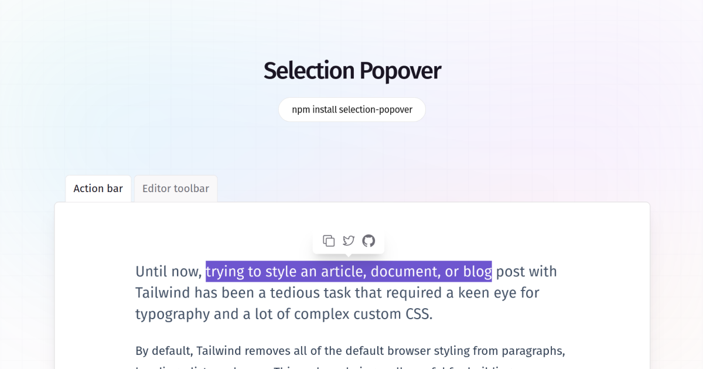

<p align="center">
  <a align='center' href="https://selection-popover.vercel.app">
    
  </a>
</p>

<p align="center">
  Easy-to-use, composable react selection popover
</p>

<div align="center">

<a href="https://www.npmjs.com/package/selection-popover"></a>
<a href="https://www.npmjs.com/package/selection-popover"></a>

</div>

## Install

```bash
npm install selection-popover
```

## Content

- [Anatomy](#anatomy)
- [API Reference](#api-reference)
  - [Root](#root)
  - [Trigger](#trigger)
  - [Portal](#portal)
  - [Content](#content)
  - [Arrow](#arrow)
- [Examples](#examples)
  - [Origin-aware animations](#origin-aware-animations)
  - [Collision-aware animations](#collision-aware-animations)
  - [Unmount animations](#unmount-animations)
  - [Use with Radix Toolbar](#use-with-radix-toolbar)
- [Acknowledge](#acknowledge)

## Anatomy

Import all parts and piece them together.

```jsx
import * as Selection from 'selection-popover'

export default () => (
  <Selection.Root>
    <Selection.Trigger />
    <Selection.Portal>
      <Selection.Content>
        <Selection.Arrow />
      </Selection.Content>
    </Selection.Portal>
  </Selection.Root>
)
```

## API Reference

### Root

Contains all the parts of a selection.

| Prop           | Type                      | Default | Description                                                                                                         |
| -------------- | ------------------------- | ------- | ------------------------------------------------------------------------------------------------------------------- |
| `defaultOpen`  | `boolean`                 | -       | The open state of the hover card when it is initially rendered. Use when you do not need to control its open state. |
| `open`         | `boolean`                 | -       | The controlled open state of the popover. Must be used in conjunction with `onOpenChange`.                          |
| `onOpenChange` | `(open: boolean) => void` | -       | Event handler called when the open state of the popover changes.                                                    |
| `whileSelect`  | `boolean`                 | `false` | When `true`, the popover will open while the text is selected, otherwise only when the mouse up.                    |
| `disabled`     | `boolean`                 | `false` | When true, the popover won't open when text is selected.                                                            |

### Trigger

The area that opens the popover. Wrap it around the target you want the popover to open when a text is selected.

| Prop      | Type      | Default | Description                                                                                                                                                                                                   |
| --------- | --------- | ------- | ------------------------------------------------------------------------------------------------------------------------------------------------------------------------------------------------------------- |
| `asChild` | `boolean` | `false` | Change the component to the HTML tag or custom component of the only child. This will merge the original component props with the props of the supplied element/component and change the underlying DOM node. |

### Portal

When used, portals the content part into the `body`.

| Prop         | Type          | Default         | Description                                                                                                                                                                              |
| ------------ | ------------- | --------------- | ---------------------------------------------------------------------------------------------------------------------------------------------------------------------------------------- |
| `forceMount` | `boolean`     | -               | Used to force mounting when more control is needed. Useful when controlling animation with React animation libraries. If used on this part, it will be inherited by `Selection.Content`. |
| `container`  | `HTMLElement` | `document.body` | Specify a container element to portal the content into.                                                                                                                                  |

### Content

The component that pops out when a text is selected.

| Prop                | Type                                        | Default   | Description                                                                                                                                                                                                               |
| ------------------- | ------------------------------------------- | --------- | ------------------------------------------------------------------------------------------------------------------------------------------------------------------------------------------------------------------------- |
| `asChild`           | `boolean`                                   | false     | Change the component to the HTML tag or custom component of the only child. This will merge the original component props with the props of the supplied element/component and change the underlying DOM node.             |
| `forceMount`        | `boolean`                                   | -         | Used to force mounting when more control is needed. Useful when controlling animation with React animation libraries. It inherits from `Selection.Portal`.                                                                |
| `side`              | `"top" \| "right" \| "bottom" \| "left"`    | `top`     | The preferred side of the selection to render against when open. Will be reversed when collisions occur and `avoidCollisions` is enabled.                                                                                 |
| `sideOffset`        | `number`                                    | `0`       | The distance in pixels from the selection.                                                                                                                                                                                |
| `align`             | `"start" \| "center" \| "end"`              | `center`  | The preferred alignment against the selection. May change when collisions occur.                                                                                                                                          |
| `alignOffset`       | `number`                                    | `0`       | An offset in pixels from the `"start"` or `"end"` alignment options.                                                                                                                                                      |
| `avoidCollisions`   | `boolean`                                   | `true`    | When `true`, overrides the `side` and `align` preferences to prevent collisions with boundary edges.                                                                                                                      |
| `collisionBoundary` | `Element \| null \| Array<Element \| null>` | `[]`      | The element used as the collision boundary. By default this is the viewport, though you can provide additional element(s) to be included in this check.                                                                   |
| `collisionPadding`  | `number \| Partial<Record<Side, number>>`   | `0`       | The distance in pixels from the boundary edges where collision detection should occur. Accepts a number (same for all sides), or a partial padding object, for example: `{ top: 20, left: 20 }`.                          |
| `arrowPadding`      | `number`                                    | `0`       | The padding between the arrow and the edges of the content. If your content has `border-radius`, this will prevent it from overflowing the corners.                                                                       |
| `sticky`            | `"partial" \| "always"`                     | `partial` | The sticky behavior on the align axis. `"partial"` will keep the content in the boundary as long as the trigger is at least partially in the boundary whilst `"always"` will keep the content in the boundary regardless. |
| `hideWhenDetached`  | `boolean`                                   | `false`   | Whether to hide the content when the text becomes fully occluded.                                                                                                                                                         |

| Data Attribute | Values                                   |
| -------------- | ---------------------------------------- |
| `[data-state]` | `"open" \| "closed"`                     |
| `[data-side]`  | `"left" \| "right" \| "bottom" \| "top"` |
| `[data-align]` | `"start" \| "end" \| "center"`           |

| CSS Variable                                   | Description                                                                   |
| ---------------------------------------------- | ----------------------------------------------------------------------------- |
| `--selection-popover-content-transform-origin` | The `transform-origin` computed from the content and arrow positions/offsets. |
| `--selection-popover-select-width`             | The width of the select.                                                      |
| `--selection-popover-select-height`            | The height of the select.                                                     |

### Arrow

An optional arrow element to render alongside the popover. This can be used to help visually link the selected text with the `Selection.Content`. Must be rendered inside `Selection.Content`.

| Prop      | Type      | Default | Description                                                                                                                                                                                                   |
| --------- | --------- | ------- | ------------------------------------------------------------------------------------------------------------------------------------------------------------------------------------------------------------- |
| `asChild` | `boolean` | `false` | Change the component to the HTML tag or custom component of the only child. This will merge the original component props with the props of the supplied element/component and change the underlying DOM node. |
| `width`   | `number`  | `10`    | The width of the arrow in pixels.                                                                                                                                                                             |
| `height`  | `number`  | `5`     | The height of the arrow in pixels.                                                                                                                                                                            |

## Examples

### Origin-aware animations

```jsx
// index.jsx
import * as Selection from 'selection-popover'
import './styles.css'

export default () => (
  <Selection.Root>
    <Selection.Trigger>...</Selection.Trigger>
    <Selection.Portal>
      <Selection.Content className="SelectionContent">...</Selection.Content>
    </Selection.Portal>
  </Selection.Root>
)
```

```css
/* styles.css */
.SelectionContent {
  transform-origin: var(--selection-popover-content-transform-origin);
  animation: scaleIn 500ms cubic-bezier(0.16, 1, 0.3, 1);
}

@keyframes scaleIn {
  from {
    opacity: 0;
    transform: scale(0);
  }
  to {
    opacity: 1;
    transform: scale(1);
  }
}
```

### Collision-aware animations

```jsx
// index.jsx
import * as Selection from 'selection-popover'
import './styles.css'

export default () => (
  <Selection.Root>
    <Selection.Trigger>...</Selection.Trigger>
    <Selection.Portal>
      <Selection.Content className="SelectionContent">...</Selection.Content>
    </Selection.Portal>
  </Selection.Root>
)
```

```css
/* styles.css */
.SelectionContent {
  animation-duration: 400ms;
  animation-timing-function: cubic-bezier(0.16, 1, 0.3, 1);
}
.SelectionContent[data-state='open'][data-side='top'] {
  animation-name: slideDownAndFade;
}
.SelectionContent[data-state='open'][data-side='bottom'] {
  animation-name: slideUpAndFade;
}

@keyframes slideDownAndFade {
  from {
    opacity: 0;
    transform: translateY(-2px);
  }
  to {
    opacity: 1;
    transform: translateY(0);
  }
}

@keyframes slideUpAndFade {
  from {
    opacity: 0;
    transform: translateY(2px));
  }
  to {
    opacity: 1;
    transform: translateY(0);
  }
}
```

### Unmount animations

```jsx
// index.jsx
import * as Selection from 'selection-popover'
import './styles.css'

export default () => (
  <Selection.Root>
    <Selection.Trigger>...</Selection.Trigger>
    <Selection.Portal>
      <Selection.Content className="SelectionContent">...</Selection.Content>
    </Selection.Portal>
  </Selection.Root>
)
```

```css
/* styles.css */
.SelectionContent {
  animation-duration: 400ms;
  animation-timing-function: cubic-bezier(0.16, 1, 0.3, 1);
}
.SelectionContent[data-state='open'] {
  animation-name: slideDownAndFade;
}
.SelectionContent[data-state='closed'] {
  animation-name: slideUpAndFade;
}

@keyframes slideDownAndFade {
  from {
    opacity: 0;
    transform: translateY(-2px);
  }
  to {
    opacity: 1;
    transform: translateY(0);
  }
}

@keyframes slideUpAndFade {
  from {
    opacity: 1;
    transform: translateY(0));
  }
  to {
    opacity: 0;
    transform: translateY(-2px);
  }
}
```

### Use with [Radix Toolbar](https://www.radix-ui.com/docs/primitives/components/toolbar)

```jsx
import * as Selection from 'selection-popover'
import * as Toolbar from '@radix-ui/react-toolbar'

export default () => (
  <Selection.Root>
    <Selection.Trigger>...</Selection.Trigger>
    <Selection.Portal>
      <Selection.Content asChild>
        <Toolbar.Root>...</Toolbar.Root>
        <Selection.Arrow />
      </Selection.Content>
    </Selection.Portal>
  </Selection.Root>
)
```

## Acknowledgements

- API heavily inspired on [Radix UI](https://www.radix-ui.com/)
- Inspired by this [tweet](https://twitter.com/TobiasWhetton/status/1612821266242715648) from [Tobias Whetton](https://twitter.com/TobiasWhetton)
